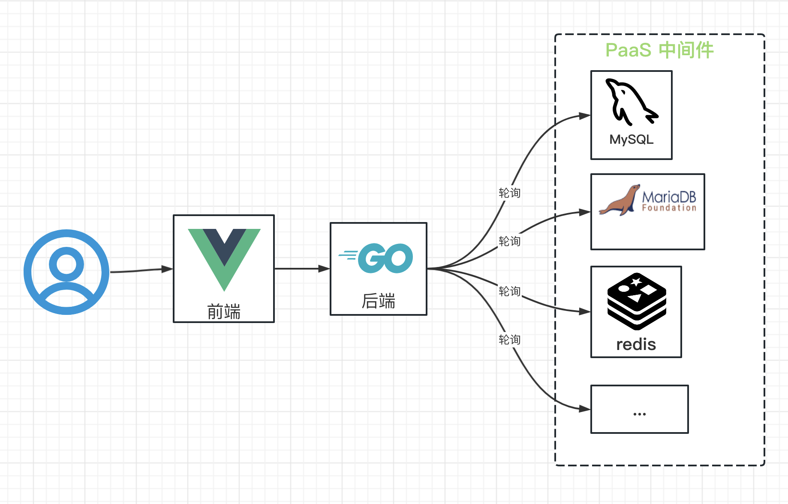
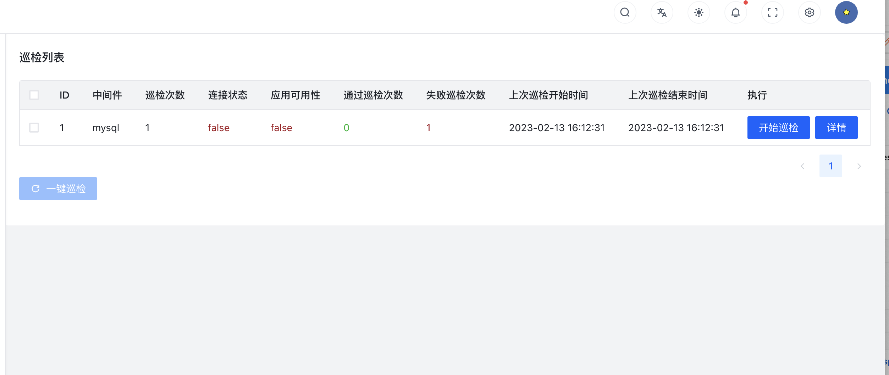
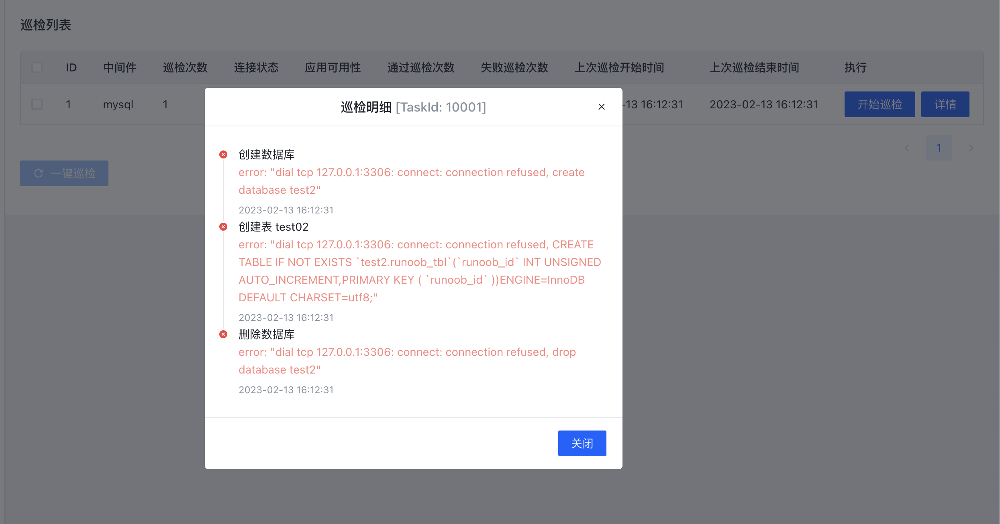

# 一、项目介绍

## 1.1 概述

土拨鼠是一款轻量级的 PaaS 巡检应用，对于常见的 PaaS 中间件，从连通性和应用可用性进行巡检。目前以实现 mysql 的自定义巡检。

## 1.2 架构设计



## 1.3 配置说明

### 1.3.1 系统配置

> 系统配置定义了巡检的基本信息，以及日志级别等；
> 代码配置文件位于: manifest/config/config.yaml

- 系统配置
```
# 服务基本配置
server:
  # 启动端口
  address:     ":8000"
  openapiPath: "/api.json"
  swaggerPath: "/swagger"

logger:
  # 日志级别
  level : "all"
  stdout: true

# 登录管理员账号和密码
admin:
  username: "admin"
  password: "admin"

# Db 建表 sql 文件
initSql: "manifest/document/sqlite/marmot.sql"

# 巡检结果存储数据库
database:
  default:
    link:   "sqlite::@file(manifest/document/sqlite/marmot.db)"
    debug:  true
```

### 1.3.2 业务配置

> 业务的巡检项可以灵活配置，可以开启或者关闭任一个场景。
> 配置文件位于: manifest/config/config.yaml

- 巡检任务配置

```
# 巡检任务配置
inspection:
  # mysql 巡检配置
  mysql: 
    enabled: true
    url: "mysql:root:coding123@tcp(127.0.0.1:3306)"
    # 巡检项可自定义添加
    items:
        # 页面展示巡检步骤
      - name: 创建数据库
        # 执行命令
        cmds: 
          - "create database test2"
      - name: 创建表 test02
        cmds: 
          - "CREATE TABLE IF NOT EXISTS `test2.runoob_tbl`(`runoob_id` INT UNSIGNED AUTO_INCREMENT,PRIMARY KEY ( `runoob_id` ))ENGINE=InnoDB DEFAULT CHARSET=utf8;"
      - name: 删除数据库
        cmds: 
          - "drop database test2"
```

### 1.4 部署启动说明

支持源码级别启动，需要分别启动后端和前端项目。

1. 启动后端

`go run main.go`

2. 启动前端

```
cd ..
git clone https://github.com/lusson-luo/marmot-front.git
yarn run dev
```

3. 访问

http://localhost:5173/
账户: admin
密码: admin

### 1.5 使用说明

点击开始巡检，可以手动触发巡检


点击 详情，可以查看上次执行每步结果


# 二、 代码结构

## 2.1 项目框架

### 2.1.1 总体项目结构

> 项目结构分为 4个部分，api, hack, internal, manifest, 是 goframe 标准结构。

简单的介绍一下这几部分的核心功能：

- api: 定义接口的 url，输入输出字段
- hack: gf 工具配置，可以通过数据库生成通用 dao，service 代码
- internal: 业务实现代码
- manifest: 交付清单，包含程序编译、部署、运行、配置的文件。

> goframe 框架结构

| 目录/文件名称 |	说明 | 	描述 |
|--|--|--|--|
| api |	对外接口 |	对外提供服务的输入/输出数据结构定义。考虑到版本管理需要，往往以api/v1...存在。 |
| hack	| 工具脚本	| 存放项目开发工具、脚本等内容。例如，CLI工具的配置，各种shell/bat脚本等文件。| 
| internal	| 内部逻辑	| 业务逻辑存放目录。通过Golang internal特性对外部隐藏可见性。| 
|   - cmd	| 入口指令	| 命令行管理目录。可以管理维护多个命令行。| 
|   - consts	| 常量定义	| 项目所有常量定义。| 
|   - controller	| 接口处理	| 接收/解析用户输入参数的入口/接口层。| 
|   - dao	| 数据访问	| 数据访问对象，这是一层抽象对象，用于和底层数据库交互，仅包含最基础的 CURD 方法| 
|   - logic	| 业务封装	| 业务逻辑封装管理，特定的业务逻辑实现和封装。往往是项目中最复杂的部分。| 
|   - model	| 结构模型	| 数据结构管理模块，管理数据实体对象，以及输入与输出数据结构定义。| 
|     - do	| 领域对象	| 用于dao数据操作中业务模型与实例模型转换，由工具维护，用户不能修改。| 
|     - entity	| 数据模型	| 数据模型是模型与数据集合的一对一关系，由工具维护，用户不能修改。| 
|   - service	| 业务接口	| 用于业务模块解耦的接口定义层。具体的接口实现在logic中进行注入。| 
| manifest	| 交付清单	| 包含程序编译、部署、运行、配置的文件。常见内容如下：| 
|   - config	| 配置管理	| 配置文件存放目录。| 
|   - docker	| 镜像文件	| Docker镜像相关依赖文件，脚本文件等等。| 
|   - deploy	| 部署文件	| 部署相关的文件。默认提供了Kubernetes集群化部署的Yaml模板，通过kustomize管理。| 
| resource	| 静态资源	| 静态资源文件。这些文件往往可以通过 资源打包/镜像编译 的形式注入到发布文件中。| 
| go.mod	| 依赖管理	| 使用Go Module包管理的依赖描述文件。| 
| main.go	| 入口文件	| 程序入口文件。| 

## 2.2 业务封装

### 2.2.1 登录、鉴权

- internal/middleware/middleware.go: 提供统一鉴权处理
- internal/controller/login.go: 提供登录
- internal/controller/user.go: 提供 token 续签

### 2.2.2 巡检

- internal/controller/inspection.go: 提供巡检接口

# 三、 开发指引

## 3.1 如何添加巡检场景

1. 在业务配置 manifest/config/config.yaml 的 inspection 添加巡检场景。

```
  # mariadb 巡检配置
  mariadb: 
    enabled: true
    url: "mysql:root:coding123@tcp(127.0.0.1:3306)"
    # 巡检项可自定义添加
    items:
        # 页面展示巡检步骤
      - name: 创建数据库
        # 执行命令
        cmds: 
          - "create database test2"
      - name: 创建表 test02
        cmds: 
          - "CREATE TABLE IF NOT EXISTS `test2.runoob_tbl`(`runoob_id` INT UNSIGNED AUTO_INCREMENT,PRIMARY KEY ( `runoob_id` ))ENGINE=InnoDB DEFAULT CHARSET=utf8;"
      - name: 删除数据库
        cmds: 
          - "drop database test2"
```

2. 创建巡检逻辑核心代码文件

在 internal/logic/ 目录创建一个 mariadbInspector.go 的文件，仿造 mysqlInspector.go 实现 inspect 方法。

3. 添加巡检场景

在 internal/logic/inspection.go 的 registerInspectors 方法和 inspect 方法添加新的巡检场景。

4. 完成

重新启动，巡检列表页面会显示新的巡检项。

